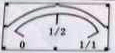
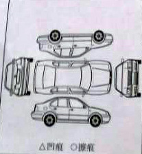

---
title:carcare 经典使用场景
author:zozoh
---

# 人物

* 客户 : 王老板
* 维修 : 胡鑫

# 故事

## 基本情况
清早，见了一中年男子进了店，胡鑫忙抄起桌上的 iPad 的迎了上去。

问明了来意，确认此人是来修车而不是来问路之后，胡鑫打开了 `carcare`
应用，抬头问道：“老板怎么称呼？”

“啊，哈，我姓王”

这是一辆黑色的的帕萨特，胡鑫在 `carcare` 界面上，点击了 `下单` 按钮，
在弹出的第一步界面输入了:
 * 车型
 * 车牌
 * 生产年份 (通过向王老板询问)
 * 车身颜色
 * 进厂日期和时间默认是当前时间，胡鑫也就没必要填写
 * 车架号(??等等，啥叫车架号?? 给个解释咯，三金哥 ^_^)

## 客户需求
之后，胡鑫点击 `下一步>客户陈述` 按钮，界面是一个大大的录音按钮

"王老板，你要修啥？"

"换机油啦，再做做保养，发动机还有点小毛病 ..."

*... 此处省略若干对话 ...*

胡鑫停止了录音，示意王老板打开驾驶室。

## 驾驶室确认
钻进驾驶室，胡鑫按 `下一步>行驶里程`，界面变成一个一半是相机，一半是一个数字输入框， 胡鑫对着里程表，咔嚓拍了一下。然后把表的数字抄到数字输入框里。
按完确认后，界面变成 `油量确认`，也是一半是相机，一半是一个仪表盘

胡鑫拍了一下油量表，然后在仪表盘上用手一划，标记了油量。
随后点击 `功能确认` 将车内相应的功能部件，比如天线，音响等依次检查并做记录。

## 外观受损确认
钻出车，胡鑫点按 `外观受损确认`，那是一个车辆的五面图的界面

胡鑫依次检查车辆的每个面，遇到 `凹痕` 或 `擦痕`，就用相应的符号点击一下
五面图对应的部分，界面就显示出一个相机，胡鑫对着受损部位咔嚓一下，做了照片记录。

经过仔细检查后，胡鑫按 `下一步>维修类型` 经过询问，将维修类型选为 `定期保养`。
按`下一步>关爱服务`后，胡鑫问:"老板，免费洗车，洗不洗？"

"你们洗的干净吗？上次我 ...@#%@#@#$ "

*... 此处省略对话若干 ...*

最后胡鑫按 `客户信息` 按钮，留下王老板的电话和学名。王老板递过一支烟，说：“兄弟费心啦”， 两个人于是攀谈了起来，还不是发出着些基情四射的笑声。

正聊的高兴，同事跑了过来找胡鑫要 iPad，因为店里就配了一个，大家只能互相借着用。 

胡鑫低头检查了一下，最后那个大大的 `确认订单` 还在那里，就点击确认，递给了同事。 

`carcare` 会定期将这些订单数据保存在云端，以备日后统计分析。所以胡鑫并不担心数据丢失的问题。

